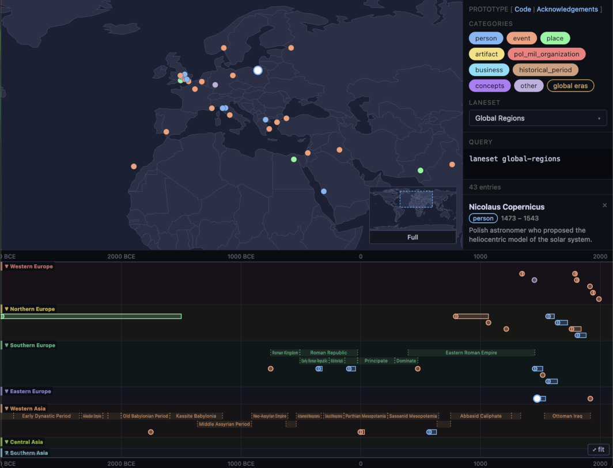

# README for World Timelines - Prototype

World Timelines is an app that enables a deeper understanding of history by combining maps with chronologies. What technologies were developed where and when? How did borders change over time? Which historical figures from different continents overlapped? Immerse yourself in these questions and limitless others.



## Project Basics

This prototype repo has a static single-page web app (SPA), fake data, and a simple webserver.

### See CLAUDE.md for developer guidelines

I have some simple development guidelines for Claude, which are applicable to humans, too.

### See development-process.md

development-process.md describes the development process I asked Claude to use; it is probably a bit cumbersome for humans, but Claude was fine with it.
If there were other humans involved, I probably would have used a more traditional work-management system, as much as I enjoyed the nimbleness of having all of the process in one place.

### Backend

Data lives in a local PostgreSQL + PostGIS database (see `db/`). `local-concept-server` serves a small JSON API backed by that database (querying it by shelling out to the `psql` CLI), and the web client caches entries/eras/lanesets locally in IndexedDB, only fetching what's missing or stale. See `plans/indexeddb-cache-and-server-rewrite.md` for the design.

This prototype has ingestion of wikipedia dumps.

`./en_wiki_download` - this is where we should keep the downloaded and compressed wikipedia bz2:
<https://dumps.wikimedia.org/enwiki/latest/enwiki-latest-pages-articles-multistream-index.txt.bz2>
<https://dumps.wikimedia.org/enwiki/latest/enwiki-latest-pages-articles-multistream.xml.bz2>
These are "multistream" bz2, so the dump can be accessed without decompressing the whole thing.

The download goes much faster as a torrent if you can do that <https://meta.wikimedia.org/wiki/Data_dump_torrents#English_Wikipedia>.


## Running the Web Client (Local)

The web client is a SPA served by a small local server at `web-client/local-concept-server/`, which also exposes a JSON API (`/api/entries`, `/api/lanesets`, etc.) backed by a local PostgreSQL + PostGIS database.

### Database (one-time setup, then as needed)

```bash
brew install postgresql@18 postgis   # one-time; see plans/install-local-postgres.md
bash db/init-db.sh                   # creates/starts the local cluster, applies the schema, seeds it
```

See `db/README.md`. Safe to re-run `db/init-db.sh` any time (it reloads the seed data, not the database itself).

**Status**: as of 2026-07-16, PostgreSQL 18 + PostGIS are installed and the local cluster at `db/.pgdata` is running (started by `db/init-db.sh`) with the `world_timelines` database seeded. It is **not** registered as a background service (see `plans/install-local-postgres.md`), so it only stays up as long as the machine doesn't reboot and the `postgres` process isn't killed. Check with `pg_ctl status -D db/.pgdata` (full path: `/opt/homebrew/opt/postgresql@18/bin/pg_ctl`); if it's not running, `bash db/init-db.sh` brings it back exactly as it was (idempotent — reloads seed data, doesn't touch anything else).

### Build

```bash
# Build the web client TypeScript
cd web-client
npm run build

# Build the local server
cd local-concept-server
npm run build
```

### Run

```bash
cd web-client/local-concept-server
npm start
```

Opens at `http://localhost:4242` by default. Override the port with `PORT=8080 npm start`.

If `psql` isn't on your `PATH` (Homebrew's `postgresql@18` is keg-only), point at it explicitly: `PSQL_BIN=/opt/homebrew/opt/postgresql@18/bin/psql npm start`. `PGHOST`/`PGDATABASE` default to the local cluster created by `db/init-db.sh` (`db/.pgdata`, database `world_timelines`) and don't need to be set for local dev.

### Data source

The gear icon in the app's upper-right switches between the local Postgres
test data (default) and live data queried directly from the browser against
Wikidata's public QLever SPARQL endpoint — no setup required for the latter,
it's just a different backend for the same query worker. See
`plans/wikidata-qlever-data-source.md`.

### Wikidata bulk download

`db/fetch-wikidata-persons.mjs` bulk-downloads Wikidata `person` records
(matching the same filters as the live query — real human, has a birth
date, no sports figures, has an English Wikipedia page, not fictional) into
a Postgres JSONB document collection (`wikidata_documents`), for
offline/local use beyond the live QLever query path above. See
`plans/wikidata-bulk-person-download.md`.

**For this prototype, only pre-1900 records are downloaded** (`--year-min
-3000 --year-max 1899`), not the full dataset. Measured directly before
deciding: the full set matching the query filters is ~1.24M records
(~2.6 GB estimated, extrapolated at ~2,112 bytes/row from a validated
4,421-row sample), and **~70% of that (818,687 of 1,241,767) is
20th/21st-century** (born 1900 or later) — leaving **~30% (423,080
records, ~0.89 GB estimated) born in 1899 or earlier**. Limiting to that
pre-1900 slice cuts both the download size and the runtime by roughly
two-thirds for this prototype's purposes. The full-range capability isn't
removed — the same script and schema support the complete `-3000`..`2100`
range later with no code changes, just different `--year-min`/`--year-max`
arguments (or the defaults). Full writeup:
`investigations/wikidata-bulk-download-scope-decision.md`.

---

## Running the Ingester

The ingester reads the Wikipedia multistream dump and produces a TSV of historical events.

### Build

```bash
cd ingester
npm run build
```

### Run

```bash
cd ingester
node dist/index.js \
  ../en_wiki_download/enwiki-20260401-pages-articles-multistream.xml.bz2 \
  ../en_wiki_download/enwiki-20260401-pages-articles-multistream-index.txt.bz2 \
  --output collected_entries.tsv \
  --config ingest.config.tsv \
  --status-log ingest_status.tsv \
  --runs-log ingest_runs.json \
  --catalog infobox-catalog.tsv
```

This writes collected entries to `collected_entries.tsv` while it runs (via `collected_entries.tsv.partial`), logging progress to `ingest_status.tsv`. If interrupted, resume from the last checkpoint with `--resume` added to the command above.

### Config

Edit `ingest.config.tsv` to control filters. Active (uncommented) settings override defaults:

| Key | Value | Effect |
|-----|-------|--------|
| `date_before` | year (e.g. `2000`) | exclude events starting after this year |
| `date_after` | year (e.g. `-3000`) | exclude events starting before this year |
| `exclude_category` | category name | skip an entire category (repeatable) |
| `stop_after_considering` | integer | stop after N considered articles |
| `stop_after_collecting` | integer | stop after N collected events |


## Acknowledgements

### This project contains and builds on public domain data from Natural Earth

Made with Natural Earth. Free vector and raster map data @ [naturalearthdata.com](https://naturalearthdata.com).

### Prototype Built using Claude Code

This prototype was built with Claude Code (Sonet, primarily), [claude.ai](https://claude.ai).

### Wikipedia, Wikimedia Foundation

This prototype contains code which ingests content from Wikipedia dumps. Per the [Wikimedia Foundation's Terms of Use](https://foundation.wikimedia.org/wiki/Policy:Terms_of_Use), when that content is shown in the app, there is a hyperlink available to the original Wikipedia page.
